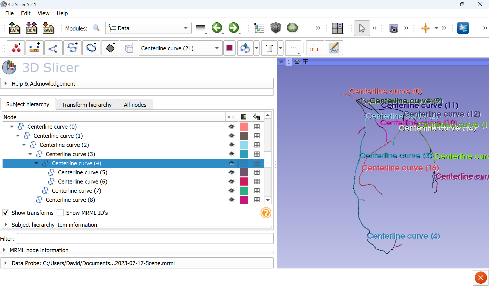
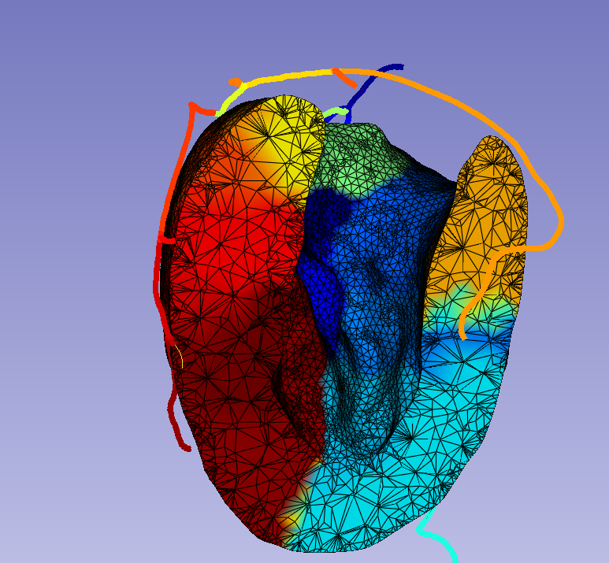
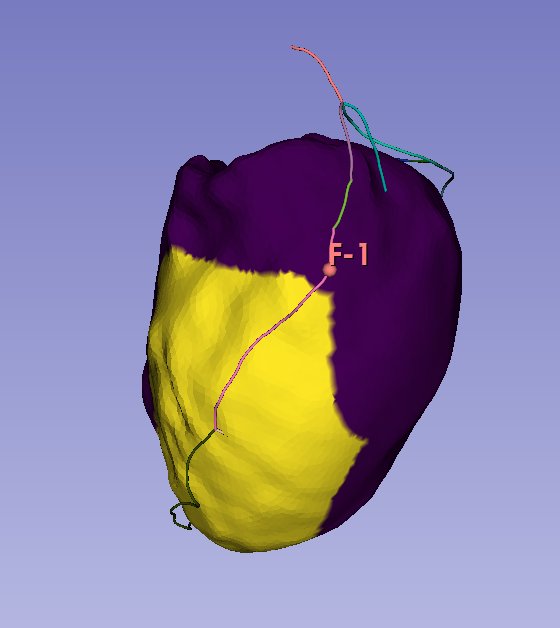

## Fractional Myocardial Mass
### Introduction
[Fractional myocardial mass](https://pubmed.ncbi.nlm.nih.gov/27423225/) (FMM) is a method for identifying a vessel specific myocardial mass i.e. the myocardial mass subtended by a vessel. This can be clinically used to identify the [myocardial mass at risk](https://pubmed.ncbi.nlm.nih.gov/25173626/) (MMAR). MMAR has been found to be a [key determinant](https://pubmed.ncbi.nlm.nih.gov/29361491/) of myocardial ischaemia. A robust method of calculating FMM is the Voronoi algorithm. This splits the space between predetermined points based on the shortest distance to those points. Hence this permits dividing tissue supplied by different blood vessels according to which blood vessel is closest to the tissue

### Functionality
The module serves two functions
1. Computation of fractional myocardial mass (FMM).
2. Computation of myocardial mass at risk (MMAR).

The basic functionality requires as input a mesh representing the LV myocardium, left coronary artery centerlines and optionally the right coronary artery centerlines. Since only a portion of the RCA generally feeds the LV myocardium it is good practice to restrict the number of segments used as input. This can be achieved by setting the input RCA centerline to be a distal segment. Only segments under this centerlines tree will be considered for associating segments to the LV myocardium. 

1. a mesh representing the left ventricle myocardium. 
2. a markups curve representing the left coronary artery
3. a markups curve representing the right coronary artery (optional)
4. a markup point indicating where the stenosis is present
Tips for generating these are given below

### Inputs

#### Input mesh
This must be a tetrahedral mesh in a vtkunstructured grid format. This can be created from a surface mesh (stl/.vtp) of the LV myocardium using the extension module [**Segment Mesher**](https://github.com/lassoan/SlicerSegmentMesher). For optimal performance the number of tetrahedrons should not be very high.

#### Input centerlines
Both the left and right coronary centerlines must be separate markupCurves. Each segment/branch should be represented by a markup curve. If you have an existing segmentation of the left and right coronaries the extension module **Extract Centerline** from [**VTMK**](https://github.com/vmtk/SlicerExtension-VMTK) extension can be used to automatically generate these centerlines (create an output under Tree for *Centerline Curve*). This will automatically generate the hierarchical format. See example output below.

If you need to manually create the centerlines this can be done through the **markups** module and selecting *Curve*. You will then proceed to generate a curve that tracks the centerline/segment. You will have to manually place them in a hierarchy. Centerlines should also not overlap each other. See demo below.

#### Input markup point
This point is used to identify the MMAR and should be placed at the location of a stenosis. When this is provided as input the MMAR will also be returned as both an array in the mesh and a separate table.

### Outputs
The module generates 2 outputs. 

#### Output table
This is a table containing the associated volume for each centerline segment. The first colunm contains the name of the centerline segment. The second column is the assoicated id for the centerline. The third column is the volume associated with each centerline segment. The fourth column contains the length of each centerline segment. If a markups fiducial is provided indicating the location of a stenosis a second table called MMAR is automatically generated.

#### Output mesh
An output tetrahedral mesh is returned where the elements are colored according to which centerline/group they belong to called "Id". This is a vtkunstructuredgrid where a point data array contains the centerline group that each vertex is assigned to.

If a markups fiducial is provided indicating the location of a stenosis a second point data array called "MMAR" is returned. This assigns a value of 1 to points that are at risk and 0 to those that are not.

